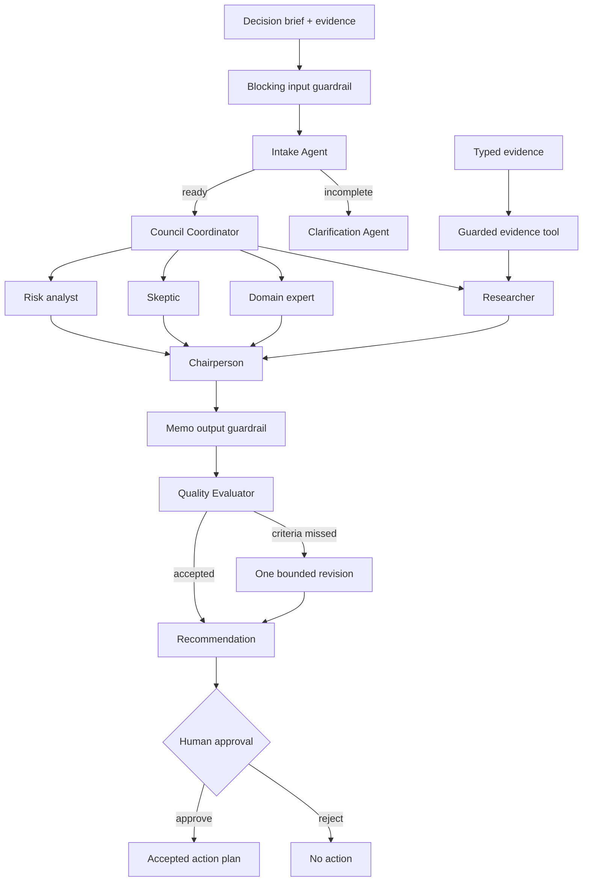

# Decision Room

Decision Room is an educational proof of multi-agent orchestration built with the
[OpenAI Agents SDK for TypeScript](https://openai.github.io/openai-agents-js/).
It shows how a leadership decision can move through semantic intake routing,
independent specialist analysis, adversarial synthesis, rubric evaluation, one
bounded revision, and explicit human approval before a consequential action.

The system advises; it does not silently execute. Its orchestration, guardrails,
approval boundary, persisted state, telemetry, and evaluation results are kept
visible so the repository can be studied and adapted by the community.

## Governed workflow



Two orchestration patterns are used deliberately:

- Model-selected SDK handoffs route the brief according to meaning and
  completeness.
- Deterministic application orchestration runs all four required specialists
  with `Promise.allSettled()`, permits one explicit partial failure, and stops if
  more than one specialist is unavailable.

## What the repository demonstrates

| Capability | Implementation |
| --- | --- |
| Agents | Intake, clarification, coordinator, four specialists, chair, evaluator, and implementation planner |
| Handoffs | Typed intake transfers to clarification or council coordination |
| Tools | Researcher evidence inspection plus an approval-required action-plan tool |
| Guardrails | Blocking input, tool input/output, memo output, and protected-action checks |
| Structured output | Zod contracts for every agent and API result |
| Human in the loop | `needsApproval`, serialized `RunState`, approve/reject, and resumed execution |
| Persistence | D1 decision sessions, evaluations, interrupted state, approvals, and action plans |
| Reliability | 45-second run deadlines, one retry, partial-failure policy, and telemetry |
| Evaluation | Rubric grader, at most one chair revision, 20 deterministic fixtures, and CI |
| Observability | Named traces, safe metadata, duration, token usage, retries, and partial failures |

## Approval and persistence

The recommendation and the action are separate states. A completed council run
is persisted before the UI offers an approval action. Requesting approval runs
the Implementation Planner until its protected tool interrupts. The serialized
SDK `RunState` is stored in D1. A later approve or reject request reconstructs
the agent, restores the state with `RunState.fromString()`, resolves every
interruption, and resumes the run.

No external system is modified. In this educational project, the protected
action accepts and records a bounded implementation plan. The same pattern can
be adapted to a task tracker or messaging system only after adding appropriate
authorization, idempotency, and organization-specific controls.

The database schema and generated migration live in:

- [`db/schema.ts`](db/schema.ts)
- [`db/decision-sessions.ts`](db/decision-sessions.ts)
- [`drizzle/0000_tense_pandemic.sql`](drizzle/0000_tense_pandemic.sql)

If D1 is unavailable, the recommendation still renders but approval is marked
unavailable. The system does not pretend that interrupted state was persisted.

## Evaluator and bounded revision

After synthesis, a separate evaluator scores the memo from 1–5 on evidence
grounding, disagreement preservation, actionability, and reversibility. It also
lists unsupported claims. A score below 4 or a material unsupported claim can
trigger exactly one targeted chair revision. There is no open-ended
self-improvement loop.

The UI exposes the rubric, whether revision was required, and whether it was
performed.

## Guardrail boundaries

1. Input: rejects prompt injection, credentials, and common personal-data
   patterns before model or tool work. High-stakes categories require an
   identified qualified human reviewer.
2. Tool: validates evidence arguments and deterministic evidence results.
3. Output: requires a submitted option, facts/assumptions separation, preserved
   disagreement, and measurable stop conditions.
4. Action: validates the implementation-plan scope before approval and validates
   its result after execution.

These controls are an inspectable example, not a complete organizational safety
policy.

## Reliability and observability

Every model run has a 45-second application deadline and at most one retry. Tool
calls have shorter SDK-level timeouts. A single failed specialist is represented
as a missing perspective with zero confidence; two failures stop synthesis.

Live runs are grouped under a named workflow trace. Trace metadata includes only
operational identifiers and counts; the decision text is excluded and
`traceIncludeSensitiveData` is `false`. The response inspector reports duration,
token counts, retries, partial failures, guardrail results, and the trace ID.
Dollar cost remains `null` for live runs because model prices change and the
repository does not hard-code a potentially stale rate card.

## Evaluation suite

`evals/fixtures.json` contains 20 keyless cases covering ready briefs,
clarification routing, high-stakes review, prompt injection, secrets, personal
data, structured output, disagreement preservation, and bounded revision. Run:

```bash
pnpm eval
```

The runner writes the measured result to
[`evals/results/latest.json`](evals/results/latest.json) and fails when routing,
guardrail recall, output structure, or disagreement preservation regress. These
are deterministic demo-mode measurements, not claims about live-model quality.
Live model evaluation requires `OPENAI_API_KEY` and a separate budgeted test run.

GitHub Actions runs lint, tests, and this evaluation suite on pushes and pull
requests.

## Where the implementation lives

- [`app/api/decision/route.ts`](app/api/decision/route.ts): routing, council,
  reliability, synthesis, evaluation, revision, tracing, and persistence.
- [`app/api/decision/approval/route.ts`](app/api/decision/approval/route.ts):
  approval interruption, serialized state, approve/reject, and resume.
- [`lib/decision-governance.ts`](lib/decision-governance.ts): schemas, safety
  classification, evidence tool, and guardrails.
- [`lib/action-planner.ts`](lib/action-planner.ts): protected action-plan tool.
- [`lib/decision-types.ts`](lib/decision-types.ts): browser/server contracts.
- [`app/page.tsx`](app/page.tsx): decision workspace and governance inspector.

## Live and demo modes

With `OPENAI_API_KEY`, the API executes the real Agents SDK workflow. Without a
key, it uses a deterministic demo path with the same response contract. Demo
mode makes the interface, guardrails, evaluator, and eval suite reproducible
without token spend.

Approval requires a configured D1 binding in either mode. The live
approval/resume code is build- and source-tested locally; fully exercising it
also requires a deployed or locally emulated D1 binding and an OpenAI API key.

## Run locally

Prerequisites: Node.js 22.13 or newer and pnpm.

```bash
pnpm install
pnpm dev
```

For live agents, create `.env.local`:

```bash
OPENAI_API_KEY=your_api_key

# Optional model overrides
OPENAI_INTAKE_MODEL=gpt-5.6-terra
OPENAI_SPECIALIST_MODEL=gpt-5.6-terra
OPENAI_CHAIR_MODEL=gpt-5.6-sol
OPENAI_EVALUATOR_MODEL=gpt-5.6-terra
OPENAI_PLANNER_MODEL=gpt-5.6-terra
```

Never commit `.env.local` or API keys.

## Validate

```bash
pnpm lint
pnpm test
pnpm eval
```

Generate a migration after schema changes with `pnpm db:generate`. Migration
generation is local; applying it requires an explicitly configured D1 target.

## Threat model and limitations

- Input checks use intentionally small pattern-based demonstrations and can
  produce false positives or miss obfuscated attacks.
- Structured output and guardrails reduce malformed responses; they do not make
  model judgment infallible.
- D1 state needs production retention, access-control, encryption, and deletion
  policies appropriate to the data entered by an organization.
- Approval state should be protected with authenticated user identity and
  authorization before real organizational use.
- The action tool records a plan only. It has no task-tracker, email, payment,
  deployment, or other external side effect.
- The deterministic eval suite validates system behavior in demo mode. It does
  not replace live-model evals, red teaming, or domain-expert review.

## Deployed demo

[decision-room-council.vialyx.chatgpt.site](https://decision-room-council.vialyx.chatgpt.site/)

The hosted demo may lag local commits until a deliberate deployment is made.
