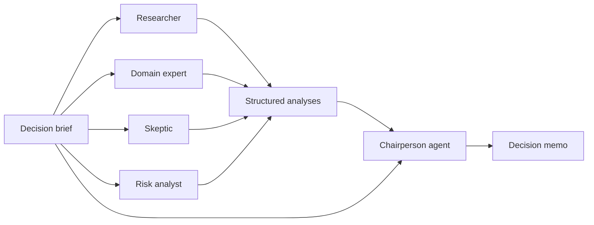

# Decision Room

Decision Room is a working proof of multi-agent orchestration built with the
[OpenAI Agents SDK for TypeScript](https://openai.github.io/openai-agents-js/).

The repository demonstrates a concrete orchestration pattern: several
specialized agents analyze the same decision independently and in parallel,
then a separate chairperson agent evaluates their structured outputs and
produces one final recommendation.

The point of the project is not to simulate a group chat. It is to make the
coordination mechanics visible and easy to inspect in code:

- distinct agent roles and instructions;
- concurrent agent execution;
- schema-validated, structured outputs;
- deterministic application-level orchestration;
- synthesis by a separate agent with a different mandate;
- a runnable fallback that demonstrates the product without an API key.

## Orchestration flow



The four specialist runs are started together with `Promise.all()`. Each agent
returns the same Zod-validated analysis shape. Only after all four analyses are
complete does the chairperson receive the original brief plus the full council
record.

This design deliberately preserves disagreement. The chairperson is instructed
to weigh evidence rather than decide by majority vote.

## The agent council

| Agent | Responsibility |
| --- | --- |
| Researcher | Separates evidence from assumptions and identifies missing data |
| Domain expert | Evaluates strategic fit, feasibility, and operating tradeoffs |
| Skeptic | Builds the strongest credible case against the apparent consensus |
| Risk analyst | Maps downside exposure, mitigations, and stop conditions |
| Chairperson | Synthesizes the independent analyses into a conditional recommendation |

## Where the agent code lives

The complete orchestration is implemented in
[`app/api/decision/route.ts`](app/api/decision/route.ts):

- `SPECIALISTS` defines the roles and mandates.
- `runLiveCouncil()` creates and runs the four specialist agents.
- `Promise.all(specialistRuns)` provides parallel fan-out and fan-in.
- the `Chairperson` agent performs the final synthesis.
- `POST()` selects the live or demo execution path.

Shared result contracts are defined in
[`lib/decision-types.ts`](lib/decision-types.ts). The product interface is in
[`app/page.tsx`](app/page.tsx).

## Live mode and demo mode

When `OPENAI_API_KEY` is available, requests execute the real Agents SDK
workflow. Without a key, the API uses a deterministic demo council so the
interface and result contract remain explorable.

Demo mode is a product fallback, not a second orchestration implementation.
The proof-of-orchestration code is `runLiveCouncil()`.

## Run locally

### Prerequisites

- Node.js 22.13 or newer
- An OpenAI API key for live agent execution

Install dependencies:

```bash
pnpm install
```

Create `.env.local`:

```bash
OPENAI_API_KEY=your_api_key

# Optional model overrides
OPENAI_SPECIALIST_MODEL=gpt-5.6-terra
OPENAI_CHAIR_MODEL=gpt-5.6-sol
```

Start the application:

```bash
pnpm dev
```

Then open [http://localhost:3000](http://localhost:3000).

## Validate

```bash
pnpm build
pnpm test
```

The tests verify that the Decision Room renders, the Agents SDK orchestration
is present, and the keyless demo request completes end to end.

## What this proof demonstrates

This repository is intentionally small, but it establishes the foundations for
larger agent systems:

1. **Specialization** — each agent has a narrow perspective instead of sharing
   one general-purpose prompt.
2. **Parallelism** — independent analysis runs concurrently to reduce overall
   workflow latency.
3. **Typed boundaries** — agents communicate through validated structures
   rather than loosely formatted prose.
4. **Separation of analysis and judgment** — specialists investigate; the chair
   makes the final call.
5. **Inspectability** — the entire orchestration fits in one server route and
   can be followed from input to output.

Natural next experiments include tool-enabled research, an evaluator/revision
loop, persisted decision sessions, human approval gates, and orchestration
evals.

## Stack

- [OpenAI Agents SDK](https://openai.github.io/openai-agents-js/)
- TypeScript and Zod
- React and vinext
- Cloudflare Workers-compatible deployment

## Deployed demo

[decision-room-council.vialyx.chatgpt.site](https://decision-room-council.vialyx.chatgpt.site)
