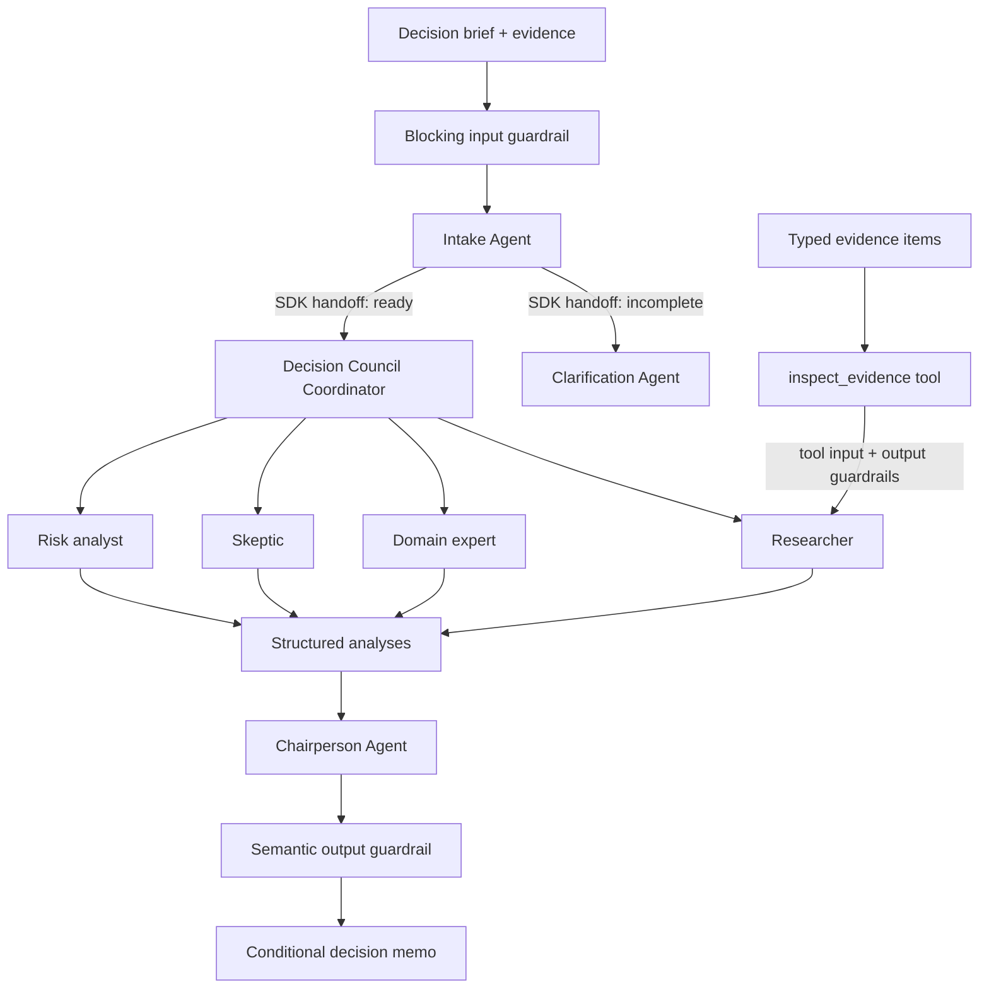

# Decision Room

Decision Room is a governed multi-agent decision system built with the
[OpenAI Agents SDK for TypeScript](https://openai.github.io/openai-agents-js/).

It is an educational, inspectable example of how to combine semantic routing,
typed tools, layered guardrails, deterministic parallel orchestration, and
trace-based observability without handing decision authority to AI.

The application accepts a decision brief, checks whether it is safe and
sufficiently specified, routes incomplete briefs to clarification, and sends
ready briefs to four independent specialists. A separate chairperson preserves
material disagreement and returns a conditional recommendation.

## Governed workflow



Two orchestration patterns are deliberately used for different jobs:

- **Model-selected SDK handoffs** route a brief according to its meaning and
  completeness. Once selected, the receiving intake specialist takes control.
- **Deterministic application orchestration** launches every council specialist
  with `Promise.all()`. Every perspective must run; routing by model choice
  would make this stage less predictable.

## SDK capabilities demonstrated

| Capability | Portfolio evidence |
| --- | --- |
| Agents | Intake, clarification, coordinator, four specialists, and chairperson |
| Tools | Researcher invokes `inspect_evidence` with a Zod input and output schema |
| Handoffs | Intake transfers control through typed clarification and council payloads |
| Guardrails | Blocking input safety, tool input/output checks, and semantic memo validation |
| Structured output | Specialist, evidence, clarification, readiness, and memo contracts |
| Tracing | One named workflow trace with custom phase spans and safe metadata |
| Parallel orchestration | All four mandatory specialist runs fan out and fan in deterministically |

## Evidence tool

Users can attach up to six evidence items and label each source as analytics,
customer interview, survey, estimate, or assumption. The Researcher is the only
specialist equipped with the `inspect_evidence` function tool.

The model chooses and invokes the tool; deterministic application logic assigns
the reliability score and warning. Tool guardrails reject malformed arguments,
prompt injection, secrets, and personal data, then validate the returned result
before it re-enters the agent loop.

This boundary demonstrates that models can decide *when* to use a capability
while application code retains control of *what the capability does*.

## Guardrail boundaries

Decision Room applies controls at three distinct boundaries:

1. **Input** — a blocking SDK guardrail runs with `runInParallel: false`, so an
   unsafe brief cannot start model or tool work. Prompt injection, credentials,
   and common personal-data patterns are rejected. Employment, medical, legal,
   and financial decisions require explicit qualified human review.
2. **Tool** — every evidence-tool call validates arguments before execution and
   validates the deterministic result afterward.
3. **Output** — the chairperson memo must name exactly one submitted option,
   preserve disagreement, separate facts from assumptions, and include at least
   two measurable stop or reversal conditions.

Zod answers “is this structure valid?” Guardrails answer “is this workflow
responsible enough to continue?”

## Tracing and sensitive-data policy

Live runs are grouped under one `Decision Room governed workflow` trace. Custom
spans identify intake routing, specialist fan-out, each specialist, and chair
synthesis plus semantic validation.

Trace metadata contains only operational fields:

- generated decision ID;
- risk posture;
- option and evidence counts;
- execution mode;
- workflow version.

The full decision text is never copied into trace metadata, and
`traceIncludeSensitiveData` is set to `false`. The interface exposes the
decision ID, handoff destination, tool-call count, passed guardrails, and trace
privacy policy as a lightweight run inspector.

## Where the implementation lives

- [`app/api/decision/route.ts`](app/api/decision/route.ts) defines the agents,
  typed handoffs, deterministic parallel council, named trace, and API flow.
- [`lib/decision-governance.ts`](lib/decision-governance.ts) contains schemas,
  evidence logic, safety classification, and all three guardrail layers.
- [`lib/decision-types.ts`](lib/decision-types.ts) defines browser/server result
  contracts.
- [`app/page.tsx`](app/page.tsx) makes evidence, intake routing, and governance
  outcomes visible in the product.

## Live and demo modes

When `OPENAI_API_KEY` is available, the request executes the real Agents SDK
workflow. Without a key, the API uses a deterministic demo path that preserves
the same response contract and visibly labels the result as a demo.

Demo mode allows the interface and governance outcomes to be explored without
spending tokens. The actual SDK handoff, tool, guardrail, and trace proof is in
the live workflow code.

## Run locally

Prerequisites:

- Node.js 22.13 or newer
- An OpenAI API key for live execution

```bash
pnpm install
```

Create `.env.local`:

```bash
OPENAI_API_KEY=your_api_key

# Optional model overrides
OPENAI_INTAKE_MODEL=gpt-5.6-terra
OPENAI_SPECIALIST_MODEL=gpt-5.6-terra
OPENAI_CHAIR_MODEL=gpt-5.6-sol
```

Start the application:

```bash
pnpm dev
```

Then open [http://localhost:3000](http://localhost:3000).

## Validate

```bash
pnpm build
pnpm test
```

The tests verify rendering, SDK primitives, the keyless governed council,
prompt-injection blocking, and clarification routing.

## Governance tradeoffs

- The intake model may route semantically, but it cannot skip a mandatory
  specialist once the council begins.
- Tool scores are deterministic and inspectable rather than generated by the
  model.
- The chairperson advises; it does not approve, send, save, or execute the
  recommendation.
- Traces favor privacy over full replay by excluding sensitive payload data.
- Guardrails are intentionally small demonstrations, not a substitute for a
  complete organization-specific safety policy.

## Next production-control milestone

The next bounded increment is a human-approved “accept and create action plan”
tool with persisted interrupted run state, followed by one rubric-based
evaluation and at most one chair revision. Those controls are intentionally not
simulated in the current release.

## Deployed demo

[decision-room-council.vialyx.chatgpt.site](https://decision-room-council.vialyx.chatgpt.site)
